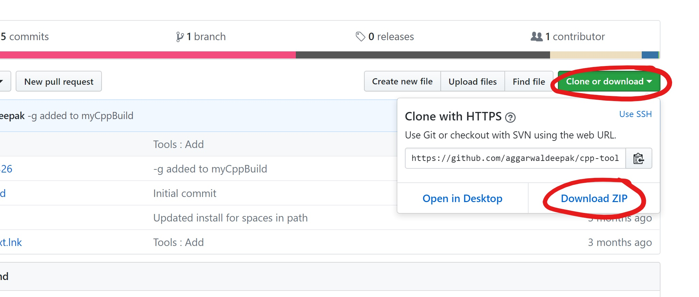
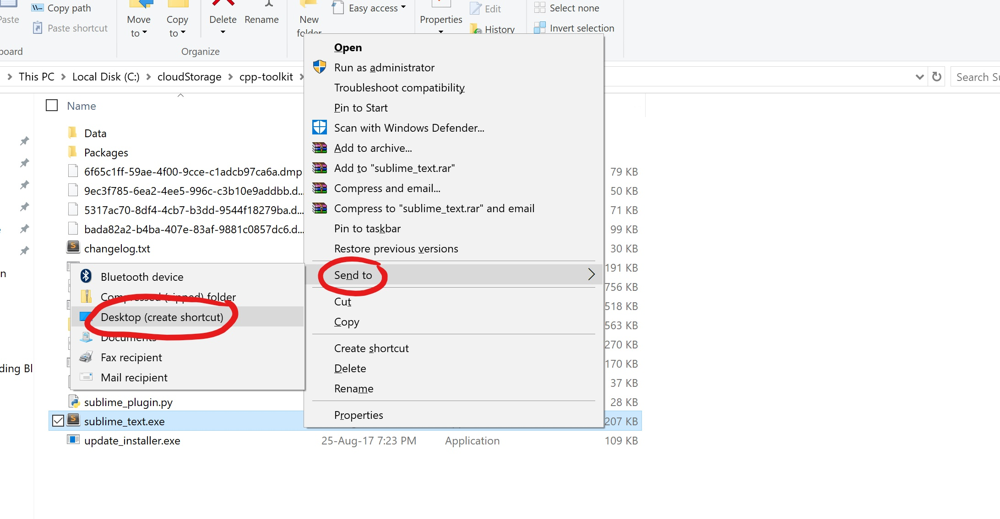

# cpp-toolkit

This repository contains few tools to quickly get started with C++ using standard libraries in Windows.

## Getting Started
1. Extract/Clone [this](https://github.com/aggarwaldeepak/cpp-toolkit) folder to any location (preferably Desktop)



2. Inside the folder `cpp-toolkit`, double click `install.bat`

3. Inside the folder `Sublime_1326`, right click `sublime_text.exe`. Choose `Send to` --> `Desktop`.



The installation is complete.

## Writing, Compiling and Running a C++ Program
1. Open `sublime_text` from Desktop.
2. Write a C++ program. You can copy the below code.

```
#include <iostream>
using namespace std;

int main(){
	cout << "Hi";
	return 0;
}
```
3. Save it with extension `.cpp`.
4. Press `Ctrl + B` (B for Build).
5. Press `Ctrl + Alt + T` (T for Terminal) to open Command prompt/terminal.
6. Press `a` and then `tab key`. Hit `Enter`.


## Tools included
The given setup can be achieved on Linux and Mac OS by installing the following tools and making little customisations.
* [Sublime Text 3](https://www.sublimetext.com/3)
* GCC Compiler Suite

## Customisations
### Sublime Text 3
The following packages have been installed alongwith Sublime Text 3
* Package Control
* PackageResouceViewer
* StyleAStyleFormatter (To autoformat C++ code)
* Terminal (To invoke terminal from the present working directory)

The following file has been used as a build system for C++ programs.
* [myCppToolkit](https://github.com/aggarwaldeepak/cpp-toolkit/blob/master/Sublime_1326/Data/Packages/User/myCppBuild.sublime-build)


## Key Bindings/Shortcuts
1. Build a programs	: `Ctrl + B`
2. Open terminal 	: `Ctrl + Alt + T`
3. Autoformat code 	: `Ctrl + Alt + F`

### Other Notes
The setup for windows has been downloaded from [MINGW.ORG](https://sourceforge.net/projects/mingw/files/)

## Author
Deepak Aggarwal
